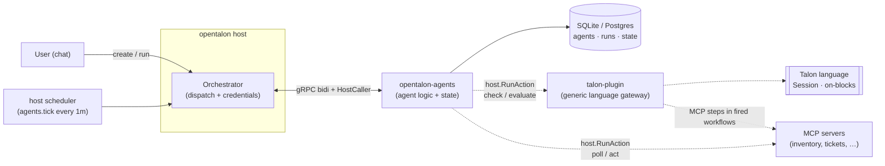
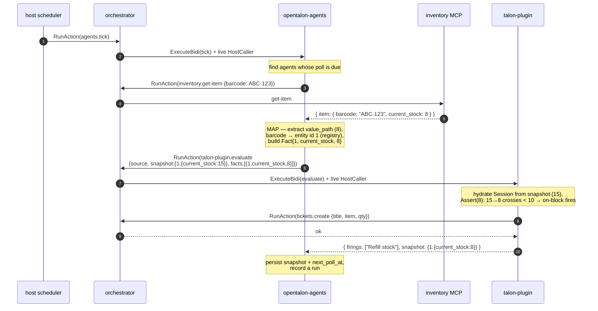
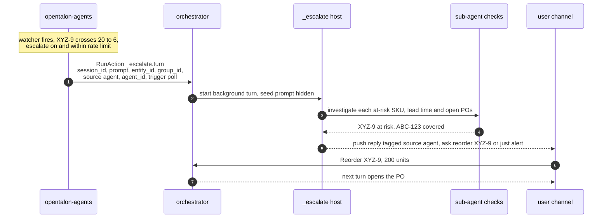

# opentalon-agents

OpenTalon plugin for **persistent, LLM-authored automations written in the [Talon](https://github.com/opentalon/talon-language) language.**

A user describes a task in chat — *"monitor the stock item with barcode ABC-123; when stock drops below 10, open a refill ticket"* — the LLM authors it **as Talon source**, and this plugin stores it and runs it **deterministically and autonomously**: no model in the loop at run time.

> **Status.** Phase 1 (create/validate/run agents) is shipped. The autonomous watcher engine (polling + reactive evaluation) is Phase 2, in progress — see [Roadmap](#roadmap). The design below is the target; sections are marked _shipped_ / _planned_.

---

## Why Talon (and not the LLM) at run time

The LLM is great at *authoring* an automation from a fuzzy request, but you don't want a model re-deciding what to do every 5 minutes forever. So the LLM writes the logic **once**, in Talon — a small deterministic language — and from then on the plugin executes it mechanically. Authoring is probabilistic; running is deterministic and cheap.

---

## Architecture

`opentalon-agents` is an **external gRPC plugin**. It owns everything about an agent — the stored Talon source, triggers, run history, and watcher state — in its own SQLite/Postgres store. It **links no `talon-language` code at all**: it reaches the language only by calling **`talon-plugin`** actions *through the host*. And it doesn't run its own scheduler — it rides the host's.



**Separation of concerns**

| Piece | Responsibility |
|-------|----------------|
| **opentalon-agents** | Agent lifecycle & state: store Talon source + triggers, poll, map data → facts, keep the fact snapshot, record runs. All "agent" logic lives here. |
| **talon-plugin** | A *generic, agent-agnostic* gateway to the Talon language. Exposes `check` (validate source) and `evaluate` (reactively run source against facts). Knows nothing about agents. |
| **opentalon host** | Loads plugins, exposes their actions to the LLM, dispatches calls (with credentials), and fires the periodic `tick` via its scheduler. |

---

## How the host invokes this plugin

Nothing is hardcoded in core — the host learns about the plugin from config, then drives it two ways.

**1. Registration** — declare it in the host `config.yaml`. On startup the host launches the binary and calls `Capabilities()`, which advertises the capability name `agents`, its actions, the authoring prompt, and `supports_callbacks: true`.

```yaml
plugins:
  agents:
    enabled: true
    plugin: "./plugins/opentalon-agents/opentalon-agents"   # or github/ref
    expose_http: true                 # only if using webhook triggers
    config:
      db: { driver: sqlite, dsn: ./agents.db }
      talon_plugin_name: talon-plugin
      webhook_secret: "${AGENTS_WEBHOOK_SECRET}"   # shared bearer for the webhook endpoint
  talon-plugin:
    enabled: true
    github: opentalon/talon-plugin
    ref: v0.2.0        # provides `check` + `evaluate`

scheduler:
  jobs:
    - name: agents-tick
      interval: "1m"
      action: agents.tick     # <capability-name>.<action>
```

**2. LLM-initiated** _(shipped)_ — the advertised actions become tools (`agents.create`, `agents.run`, …). When the user asks for an automation, the LLM calls `agents.create`; because we declare `supports_callbacks`, the host dispatches over **ExecuteBidi**, so our handler gets a **live `HostCaller`** to reach `talon-plugin`.

**3. Autonomous tick** _(engine implemented; requires the `scheduler.jobs` entry above)_ — the LLM is *not* involved. The `scheduler.jobs` entry fires `agents.tick` on a timer; the scheduler calls it through the orchestrator, again over bidi with a live `HostCaller`. The tick is **unscoped** (no user/group), so it sweeps all agents system-wide.

---

## A real example: the stock watcher

**In chat:** *"Create an agent that watches stock item barcode ABC-123 and opens a refill ticket when it drops below 10."*

The LLM calls **`agents.create`** with a name, the Talon source, and a poll trigger:

**`talon_source`** — the logic, authored by the LLM:

```talon
# React to changes in an item's stock. Fire ONCE on the downward crossing
# below 10 (prev >= 10 and new < 10) — not every tick while it stays low.
on change attr "current_stock" {
  when prev_value >= 10 and new_value < 10
  workflow "Refill stock"
}

# The action that runs when the on-block fires.
workflow "Refill stock" {
  step "ticket" {
    mcp "tickets" "create" {
      title "Refill needed for ABC-123"
      item  step("trigger").result.entity     # the item that crossed the threshold
      qty   50
    }
  }
}
```

**`triggers`** — how the engine feeds it data (structured config, also from the LLM):

```json
[
  {
    "type": "poll",
    "config": {
      "server": "inventory",
      "tool": "get-item",
      "args": { "barcode": "ABC-123" },
      "interval": "5m",
      "value_path": "item.current_stock",
      "id_field": "item.barcode",
      "attribute": "current_stock"
    }
  }
]
```

On `create`, the source is validated (`talon-plugin.check`) before it's stored — invalid Talon is rejected with compile diagnostics so the LLM can fix and retry.

---

## What happens on each tick — and where facts come in

A **fact** is an EAV triple: *(entity, attribute, value)* — e.g. *(item ABC-123, `current_stock`, 8)*. The watcher works by turning each poll into a fact and letting Talon's `Session` react to **changes** in that fact. The **snapshot** is the set of facts the agent remembers between ticks; it's what makes the watcher *edge-triggered* (fire once on the crossing) and *restart-safe* (a value that hasn't changed since last time fires nothing).



Step by step:

1. **Poll** — the engine calls the item's MCP tool through the host: `inventory.get-item{barcode: ABC-123}` → `{ "item": { "current_stock": 8 } }`.
2. **Map → fact** — it extracts the value at `value_path` (`8`), maps the external id (`ABC-123`) to a small integer via a per-agent registry, and builds a fact: `Fact{RecordID: "1", Attribute: "current_stock", Value: 8}`. *(The int mapping is required because Talon's snapshot is keyed by integer entity id.)*
3. **Evaluate** — it calls `talon-plugin.evaluate` with the stored `source`, the prior `snapshot` (last known stock, e.g. 15), and the new `facts`. talon-plugin hydrates a `Session` from the snapshot, asserts the new fact, and the `on change` block sees `15 → 8`: the `when prev_value >= 10 and new_value < 10` guard holds, so it fires and runs `"Refill stock"` — whose `mcp "tickets" "create"` step is dispatched back through the host.
4. **Persist** — the engine stores the returned snapshot (`current_stock: 8`), schedules the next poll, and records a run.

Because it's edge-triggered: `8 → 8` (unchanged) fires nothing; `8 → 7` doesn't re-fire (it didn't cross *down through* 10 again); only a fresh `≥10 → <10` transition opens another ticket. Restart is safe too — the snapshot is reloaded from the DB, so replaying the last value fires nothing.

---

## A real example: the watcher that investigates and asks you

The stock watcher above takes a **fixed** action on fire (open a ticket) — no model at run time. Some tasks instead need *judgement* when they fire: *"stock is trending down — which items are actually at risk given lead times, and should I reorder or just alert you?"* That's an LLM turn with a **question back to the user**, triggered by a deterministic signal. Opt in with the **`escalate`** argument.

**In chat:** *"Watch all my inventory SKUs, and when any of them drops below 20, look into which ones are genuinely at risk and check with me before ordering anything."*

The LLM authors the **same kind of watcher** — detection stays deterministic — but leaves the reaction to an escalation turn:

**`talon_source`** — a coarse, deterministic trip. The `when` threshold is a literal (a watcher can't compare against another fact), so the *nuanced* per-SKU reasoning is deferred to the escalation turn:

```talon
on change attr "current_stock" {
  when prev_value >= 20 and new_value < 20
  workflow "Flag for review"
}

# No fixed action here — the reaction IS the escalation turn the plugin starts
# when this block fires. Keep the workflow a light marker (some Talon builds
# want at least one step); the real work happens in the assistant turn.
workflow "Flag for review" {
  step "note" { mcp "log" "info" { message "SKU crossed the review threshold" } }
}
```

**`triggers`** — one poll fans out over every SKU in the response (`items_path`), so the *same* on-block fires per item that crosses:

```json
[
  {
    "type": "poll",
    "config": {
      "server": "inventory",
      "tool": "list-items",
      "interval": "10m",
      "items_path": "items",
      "value_path": "current_stock",
      "id_field": "barcode",
      "attribute": "current_stock"
    }
  }
]
```

**`escalate`** — the opt-in. Detection stays deterministic; only the reaction becomes model-driven, so it's rate-limited:

```json
{ "enabled": true, "max_per_window": 5, "window_seconds": 3600 }
```

`create` also captures the caller's `session_id` (injected by the host) — that's the channel the escalation turn runs in and pushes its reply to.

### What happens when it fires

When a SKU crosses `20 → below`, the engine records the firing **and** starts a background assistant turn in the user's session (via the host's built-in `_escalate` entrypoint — enabled with `orchestrator.escalation.enabled`). The turn is seeded with a synthesized prompt built from the agent's stored `description` (the user's original ask), what tripped, and the observed facts:

```
Your background agent "sku-reorder-watch" just fired and escalated to you.

What the user originally asked for:
watch all inventory SKUs; when any drops below 20, check which are at risk and ask me before ordering

What tripped the watcher:
- on-block "on change attr \"current_stock\"" for ABC-123 (workflow)
- on-block "on change attr \"current_stock\"" for XYZ-9 (workflow)

Latest observed values (facts):
[{"record_id":"1","attribute":"current_stock","value":18},{"record_id":"4","attribute":"current_stock","value":6}]

Investigate what is going on — you may fan out focused sub-agent checks to look into
each affected entity — then decide what, if anything, should be done. Come back to the
user with a short summary and ask how they would like to proceed. Do not take
irreversible action without confirming with the user first.
```

The assistant then **investigates with sub-agent checks** (one per at-risk SKU — supplier lead time, open POs), synthesizes, and **asks the user** — its reply is pushed to their channel tagged agent-originated (`source: agent`, `agent_id`, `trigger: poll`):

> Two SKUs crossed the line. **XYZ-9** is the real risk: 6 units left, ~3-week supplier lead time, no open PO — it'll stock out before a reorder lands. **ABC-123** (18 units) is comfortably covered by an open PO arriving Friday.
>
> Want me to raise a reorder for **XYZ-9** now (I'd suggest 200 units to cover the lead time), or just keep alerting you? ABC-123 I'd leave alone.

The user replies in the same conversation — *"Reorder XYZ-9, 200 units."* — and the **next turn acts** (opens the PO through the appropriate tool). Detection stayed deterministic and cheap; the LLM only ran once the signal tripped, and nothing irreversible happened without a human OK.



Guardrails: escalation is **opt-in per agent**, **edge-triggered** (fires on the crossing, not every tick), and **rate-limited** (`max_per_window` / `window_seconds`, per-agent or via the plugin defaults). Turns cost tokens and are billed to the agent owner's chat budget, so a flapping signal can't run away.

---

## Actions

| Action | Description |
|--------|-------------|
| `create` | Author an agent from Talon source (+ optional triggers, + optional `escalate`). Validated via `talon-plugin.check` before storing. |
| `list` / `show` | Inspect agents (`show` returns the full Talon source, and the escalation config when enabled). |
| `run` | Execute an agent's program now (inline) and return the result. _shipped_ |
| `update` | Replace the Talon source / triggers / escalation setting (re-validated). |
| `enable` / `disable` / `delete` | Lifecycle. |
| `tick` | Hidden (`UserOnly`) — fired by the host scheduler to drive watchers (poll → map → evaluate). _implemented_ |

`group_id` / `entity_id` are injected by the host per call; every operation is group-scoped. All actions run on the bidi path (a live `HostCaller` is needed to reach `talon-plugin`).

---

## Roadmap

- **Phase 1 — _shipped_**: plugin scaffold, SQLite/Postgres store + migrations, agent CRUD, inline `run` (validate via `check`, execute via `execute_workflow`).
- **Phase 2 — _in progress_**: the watcher/tick engine. Tracked in [#1](https://github.com/opentalon/opentalon-agents/issues/1): poll trigger + state ([#3](https://github.com/opentalon/opentalon-agents/issues/3), [#4](https://github.com/opentalon/opentalon-agents/issues/4)), `talonproxy.Evaluate` ([#5](https://github.com/opentalon/opentalon-agents/issues/5)), poller/mapper/engine ([#6](https://github.com/opentalon/opentalon-agents/issues/6)–[#8](https://github.com/opentalon/opentalon-agents/issues/8)), tick + scheduler wiring ([#9](https://github.com/opentalon/opentalon-agents/issues/9)), prompt + E2E ([#10](https://github.com/opentalon/opentalon-agents/issues/10), [#11](https://github.com/opentalon/opentalon-agents/issues/11)). Depends on `talon-plugin`'s `evaluate` action (**done**, `v0.2.0`).
- **Phase 3 — webhook triggers _implemented_**: push data instead of polling. Declare a `webhook` trigger (mapping only), set `expose_http: true` + a `webhook_secret`, and POST to the endpoint below. The handler enqueues into `pending_events`; the next tick drains and evaluates it (the HTTP request has no `HostCaller`, so evaluation is deferred to the tick).
- **Phase 4 — _implemented_** ([#13](https://github.com/opentalon/opentalon-agents/issues/13)): **`schedule` (cron) triggers** (one-shot `workflow` agent on a 5-field cron, tracked via `next_cron_at`, run through `execute_workflow`); **create-time trigger validation**; **multi-entity polls** — a poll trigger with `items_path` maps every element of a list to a fact (value_path/id_field per item), capped by `max_items_per_poll` (drops are logged, never silent); and a **configurable backoff cap** (`max_backoff_seconds`, default 30m).
- **Phase 5 — escalation & sub-agent mode _implemented_** ([#30](https://github.com/opentalon/opentalon-agents/issues/30)): a **hybrid** reaction. Detection stays deterministic (the tick), but an agent can opt into `escalate` so that when its watcher fires, instead of only running a fixed Talon action, the plugin starts a full assistant **reasoning turn** in the creator's session (via the host's built-in `_escalate` entrypoint — requires `opentalon` ≥ `v0.0.22` with `orchestrator.escalation.enabled`). That turn can investigate (including fanning out sub-agent checks), decide, and **ask the user** what to do; its reply is pushed back to the user's channel tagged as agent-originated (`source: agent`, `agent_id`, `trigger`). Opt-in per agent, edge-triggered, and rate-limited (`escalation_max_per_window` / `escalation_window_seconds`, per-agent overridable).

## Durability & restart

The plugin holds **no in-memory agent state** — the engine is DB-driven. Every `agents.tick` re-queries the DB for enabled, due agents (poll / schedule / queued webhooks) and processes them. So after a plugin or host restart, agents resume automatically:

- **agents** (source, triggers, enabled) and **agent_state** (`facts_snapshot_json`, `entity_map_json`, `next_poll_at`, `next_cron_at`, `consecutive_failures`) are persisted; each `evaluate` re-hydrates the Session from the snapshot, so an unchanged value fires nothing (no false re-fires on restart).
- **pending_events** (queued webhooks) survive and drain on the next tick.

The only external requirement is that the host keeps firing `agents.tick` — its `scheduler.jobs` entry lives in host config (dynamic jobs persist in `dataDir/scheduler/jobs.yaml`), so it resumes on host restart too. Nothing needs to "bring agents back online."

## Webhooks

With `expose_http: true`, the host reverse-proxies `/<config-key>/*` to the plugin's private listener. An external system pushes data with:

```
POST /agents/v1/hooks/<agent-name>?user_id=<owner>
Authorization: Bearer <webhook_secret>
Content-Type: application/json

{ "barcode": "ABC-123", "stock": 8 }
```

- The shared **`webhook_secret`** gates the endpoint (401 otherwise; 503 if unset). The **`user_id`** param (query or a top-level body field) scopes the lookup to that user's agent named in the path.
- The body is mapped to a fact by the agent's `webhook` trigger config (`value_path`/`id_field`/`attribute`) and evaluated on the next tick — same reactive semantics as polling. Returns `202 {"status":"queued"}`.

### Query agents

`GET /v1/agents` (same `Authorization: Bearer <webhook_secret>`) lists agent summaries — never the Talon source. AND-combined filters:

```
GET /agents/v1/agents?group_id=<g>&entity_id=<user>&name=<substr>&enabled=true
```

`group_id` (tenant), `entity_id` (creating user), `name` (case-insensitive substring), `enabled`. Fetch a single agent's full source via the `show` action.

---

## Develop

```
make build   # build the plugin binary
make test    # unit tests (store round-trip; action layer with a fake HostCaller)
make vet
```

Requires `talon-plugin` (≥ `v0.2.0`, provides `check` + `evaluate`) loaded in the same host. `opentalon-agents` itself imports **no** `talon-language` — all language access is via `host.RunAction("talon-plugin", …)`.

### End-to-end tests

A full-stack E2E (host + plugins + stub MCP) lives in `testharness/` and runs via `.github/workflows/e2e.yml`. The fast **deterministic** job runs on every PR. The **vcr-replay** job — real chat → LLM → Talon authoring, replayed from a committed cassette — is slow, so it's opt-in: add the **`e2e-vcr`** label to a PR to run it (`gh pr edit <n> --add-label e2e-vcr`). The committed cassette carries a `prompt_hash`; a cheap **cassette-check** job fails any PR where the authoring prompt changed but the cassette wasn't re-recorded. Re-recording against the real model happens on a published release (or manual dispatch), not nightly. See `testharness/README.md`.
