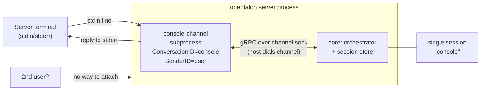
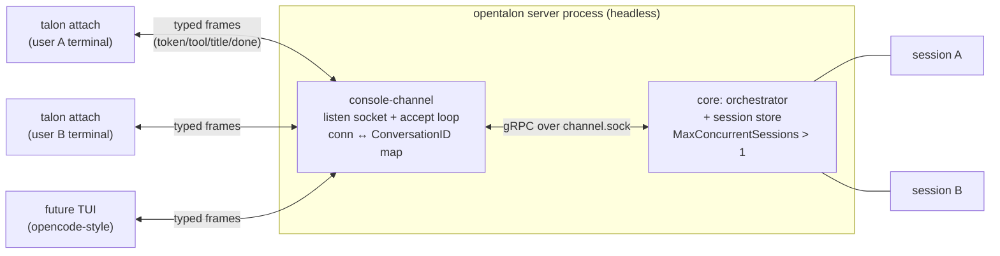

# Console channel: multi-user attach model (listen socket + streaming protocol)

## Summary

Make the console channel a **multiplexer** that multiple client sessions can
attach to over a socket, instead of a single process bound to the server's own
terminal. Each attached client gets its own conversation/session — the same way
Slack and Telegram already give every user their own session today.

## Background: why Slack/Telegram are already multi-user and console isn't

The gRPC channel protocol already carries everything needed for many
conversations over one channel link:

- Inbound messages carry `ConversationID` / `SenderID`.
- `OutboundMessage` carries `ConversationID` for routing replies.
- The core keys **sessions** off those IDs (per-session turn mutex, session
  store, `MaxConcurrentSessions`, cross-pod `SessionLocker`, server-initiated
  frames via `ChannelSender(sessionID, ...)`).

Slack/Telegram get multi-user "for free" because the remote service **is** the
multiplexer: one bot connection fans in many users, each with a distinct ID.

The console channel doesn't use any of this. It:
- reads its **own subprocess stdin** (so it's tied to the terminal that
  launched the server),
- hardcodes `ConversationID="console"`, `SenderID="user"`,
- writes replies to stderr as a single blob.

Result: one local user, one session, no streaming, no way to attach a second
client.

## Proposal

Add an **attach mode** to the console channel. In this mode the channel stops
reading server stdin and instead **listens** on a socket. A thin client
(`talon attach`) dials in; each connection becomes a unique conversation →
its own session. The channel routes replies back to the right connection by
`ConversationID`.

This is structurally identical to the Slack fan-in — the only difference is the
"remote service" is a local listen socket we own.

### Scope of change

- **console-channel repo (bulk of the work):** accept loop, per-connection →
  session mapping, outbound routing by conversation, typed streaming frames.
  Model directly on the Slack channel's fan-in.
- **core (small):** confirm per-session server-frame routing works for console;
  likely bump `MaxConcurrentSessions` default (currently 1 = sequential).
- **new thin client CLI** (`talon attach` / `talon console`): raw terminal,
  send lines, render frames.

### Protocol: typed bidirectional stream (not final-text)

The attach protocol should be a typed stream from day one, even for the plain
CLI: frames like `token`, `tool_call`, `tool_result`, `title` (the orchestrator
already emits `session.title`), `error`, `done`. Defining this as a stable
contract (proto or JSON-lines) is what unlocks streaming *and* the pluggable-TUI
future below. Shipping the plain-text version first and "adding streaming later"
means a protocol break later — cheaper to do it once.

## Architecture

### Current — single terminal, one session

The channel is a subprocess of the server and reads **its own stdin** (the
terminal that launched the server). Every message collapses to the same
hardcoded `console`/`user` IDs, so the core only ever sees one conversation.

### Proposed — attach mode, many sessions

The channel stops reading server stdin and **listens** on a socket. Thin
clients dial in; each connection is a distinct `ConversationID` → its own
session. Replies route back per connection over a typed streaming frame
protocol. Structurally identical to the Slack fan-in — the local listen socket
plays the role Slack's WebSocket plays today.

## Benefits

- **Feature parity across channels.** Console becomes multi-user like Slack/
  Telegram instead of a single-terminal special case.
- **Server can run headless.** No longer needs to own a terminal. Run it as a
  daemon/service; users attach on demand.
- **Multiple concurrent local users / sessions** on one running server, reusing
  the session machinery that already exists.
- **Streaming output** (tokens, tool calls) instead of a single stderr blob.
- **Foundation for a real TUI.** Any TUI (opencode-style, or our own) becomes a
  client of the frame protocol via a thin adapter. We don't couple to a specific
  TUI — the protocol is the contract.
- **Better local dev/testing.** Attach, drive a session, detach, re-attach —
  without restarting the server.

## Downsides / costs (be honest with the team)

- **console-channel is effectively a rewrite** from single-stdin to a
  multiplexer. Real work, not a config flag.
- **New surface area:** a listen socket + a client CLI + a wire protocol we now
  have to version and maintain.
- **Identity is unsolved for local attach.** Slack hands us a user ID; a local
  socket does not. We must decide: ephemeral per-connection ID, or client-
  supplied user/session key (which also enables session **resume**). Needs a
  decision, not a default.
- **Security if we go remote.** Unix socket = local-only, filesystem perms, no
  auth surface. TCP = true remote attach but pulls in authN + TLS. Recommend
  Unix-socket-only for v1 and treating remote as a separate, later phase — name
  this explicitly so it doesn't scope-creep.
- **Concurrency edges.** Bumping `MaxConcurrentSessions` above 1 exercises
  parallel-session paths more than today; worth a look even though per-session
  serialization already exists.

## Why it matters

Console is currently a second-class channel: single user, no streaming, tied to
the launching terminal. That's fine for a quick local smoke test and nothing
else. If we want the terminal experience to be a real interface — headless
server, multiple users, streaming, eventually a proper TUI — the attach model is
the unlock, and it mostly reuses session infrastructure we already built for
Slack. The cost is concentrated in one repo (console-channel) plus a small
client, not spread across the core.

## Suggested phasing

1. **v1 — local multi-user.** Unix socket, attach mode behind config
   (`mode: attach`), typed streaming frame protocol, reference `talon attach`
   client. Keep current own-terminal mode as the default (no break).
2. **v2 — session resume + identity.** Client-supplied key; resume existing
   session from the store.
3. **v3 — remote attach.** TCP + auth + TLS. Separate security review.
4. **v4 — pluggable TUI.** Adapter(s) on top of the stable frame protocol.

## Open questions for the team

- Identity model for local attach: ephemeral vs client-supplied key?
- Default for `MaxConcurrentSessions` once console can drive parallel sessions?
- Protocol wire format: proto (reuse channelpb style) vs JSON-lines?
- Do we keep own-terminal mode long-term, or deprecate once attach lands?
